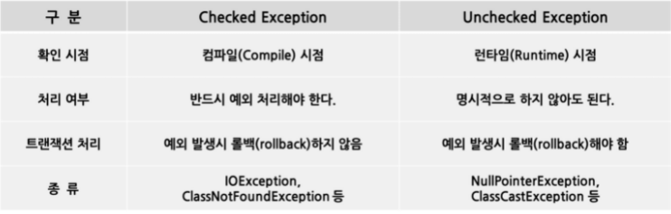

## 10장 예외

예외를 제대로 활용한다면 프로그램의 가독성, 신뢰성, 유지보수성이 높아지지만, 잘못 사용하면 반대의 효과만 나타난다.

### 아이템69 - 예외는 진짜 예외 상황에만 사용하라

___

#### 69-1. 예외를 잘못 사용하는 경우

```java
public class Main {
    public static void main(String[] args) {
        try {
            int i = 0;
            while (true)
                range[i++].climb();
        } catch (ArrayIndexOutOfBoundsException e) {
            //...
        }
    }
}
```

무한루프를 돌다가 배열의 끝에서 `ArrayIndexOutOfBoundsException`이 발생하면 끝을 내는 아주 끔찍한 방식이다.

JVM 은 배열에 접근할 때마다 경계를 넘지 않는지 검사하는데, 일반적인 반복문도 배열경계에 도달하면 종료한다.

```java
for(Mountain m:range)
        m.climb();
```

위와 같이 작성하면 된다.

**예외는 (그 이름이 말해주듯) 오직 예외 상황에서만 써야 한다. 절대로 일상적인 제어 흐름용으로 쓰여선 안 된다.** 즉, 표준적이고 쉽게 이해되는 관용구를 사용하고, 성능 개선을 목적으로 과하게 머리를 쓴
기법은 자제하라.

이 원칙은 API 설계에도 적용된다. **잘 설계된 API 라면 클라이언트가 정상적인 제어 흐름에서 예외를 사용할 일이 없게 해야 한다.**

#### 69-2. 상태 검사 메서드, 옵셔널, 특정 값 중 하나를 선택하는 지침

1. 외부 동기화 없이 여러 스레드가 동시에 접근할 수 있거나 외부 요인으로 상태가 변할 수 있다면 옵셔널이나 특정 값을 사용한다. 상태 검사 메서드와 상태 의존적 메서드 호출 사이에 객체의 상태가 변할 수 있기
   때문이다.

2. 성능이 중요한 상황에서 상태 검사 메서드가 상태 의존적 메서드의 작업 일부를 중복 수행한다면 옵셔널이나 특정 값을 선택해야 한다.

3. 다른 모든 경우엔 상태 검사 메서드 방식이 조금 더 낫다고 할 수 있다. 가독성이 살짝 더 좋고, 잘못 사용했을 때 발견하기가 쉽다. 상태 검사 메서드 호출을 깜빡 잊었다면 상태 의존적 메서드가 예외를 던져
   버그를 확실히 드러낼 것이다. 반면 특정 값은 검사하지 않고 지나쳐도 발견하기가 어렵다(옵셔널에는 해당하지 않는 문제다.)

### 아이템70 - 복구할 수 있는 상황에는 검사 예외를, 프로그래밍 오류에는 런타임 예외를 사용하라

___

자바는 문제 상황을 알리는 타입(throwable)으로 검사 예외, 런타임 예외, 에러를 제공한다. 하지만 이것들을 헷갈려하는 프로그래머가 종종 있다.

#### 70-1. 구별법

1. 호출하는 쪽에서 복구하리라 여겨지는 상황이라면 **검사 예외**를 사용하라. 검사 예외를 던지면 `try-catch`로 처리하거나 `throw`를 이용하여 더 바깥으로 전파하도록 강제하게 된다. 따라서 메서드를
   호출했을 때 발생할 수 있는 유력한 결과임을 API 사용자에게 알려주는 것이다.

2. 비검사 예외는 런타임 에러와 에러가 있다. 프로그램에서 잡을 필요가 없거나 잡아도 득보다 실이 많은 경우다. 아예 복구가 불가능할 수도 있다.

❗`Exception`, `RuntimeException`, `Error` 클래스를 상속하지 않는 `throwable` 구현은 절대 만들지 말자!



### 아이템71 - 필요 없는 검사 예외 사용은 피하라

___
검사 예외는 발생한 문제를 개발자가 처리하여 안전성을 높인다. 따라서 제대로 활용하면 API 와 프로그램의 질을 높일 수 있다. 하지만 과하게 사용하는 경우 오히려 사용하기 불편한 API 가 될 수 있다.

#### 71-1. 검사 예외를 회피하는 방법

1. 적절한 결과 타입을 담은 옵셔널을 반환하는 것이다.
    - 예외가 발생한 이유를 알려주는 부가 정보를 담을 수 없음.

2. 검사 예외를 던지는 메서드를 2개로 쪼개 비검사 예외로 바꿀 수 있다.

```java
public class Main {
    public static void main(String[] args) {
        try {
            obj.action(args);
        } catch (TheCheckedException e) {
            // 예외 상황에 대처한다.
        }
    }
}
```

위의 코드를 리팩토링하면

```java
public class Main {
    public static void main(String[] args) {
        if (obj.actionPermitted(args)) {
            obj.action(args);
        } else {
            // 예외 상황에 대처한다.
        }
    }
}
```

리팩토링 후의 API 가 딱히 더 아름답진 않지만, 더 유연하다.

> 결론: 꼭 필요한 곳에만 사용한다면 검사 예외는 프로그램의 안전성을 높여주지만, 남용하면 쓰기 고통스러운 API를 낳는다. API 호출자가 예외 상황에서 복구할 방법이 없다면 비검사 예외를 던지자. 복구가 가능하고 호출자가 그 처리를 해주길 바란다면, 우선 옵셔널을 반환해도 될지 고민하자. 옵셔널만으로는 상황을 처리하기에 충분한 정보를 제공할 수 없을 때만 검사 예외를 던지자.

### 아이템72 - 표준 예외를 사용하라

___

#### 72-1. 표준 예외를 재사용할 때 장점

1. 여러분의 API 가 다른 사람이 익히고 사용하기 쉬워진다
2. API 를 사용한 프로그램도 낯선 예외를 사용하지 않게 되어 읽기 쉽게 된다.
3. 예외 클래스 수가 적을수록 메모리 사용량도 줄고 클래스를 적재하는 시간도 적게 걸린다.

#### 72-2. 자주 재사용되는 표준 예외

1. `IllegalArgumentException`
    - 호출자가 인수로 부적절한 값을 넘길 때 던지는 예외
    - `null`을 건네면 관례상 `NullPointerException`을 던진다.

2. `IllegalStateException`
    - 객체의 상태가 호출된 메서드를 수행하기에 적합하지 않을 때 주로 던진다.
    - 어떤 시퀀스의 허용 범위를 넘는다면 `IndexOoutOfBoundsException`을 던진다.

3. `ConcurrentModificationException`
    - 단일 스레드에서 사용하려고 설계한 객체를 여러 스레드가 동시에 수정하려 할 때 던진다.

4. `UnsupportedOperationException`
    - 클라이언트가 요청한 동작을 대상 객체가 지원하지 않을 때 던진다.

**`Exception`, `RuntimeException`, `Throwable`, `Error`는 직접 재사용하지 말자.** 이 클래스들은 추상 클래스라고 생각하길 바란다.